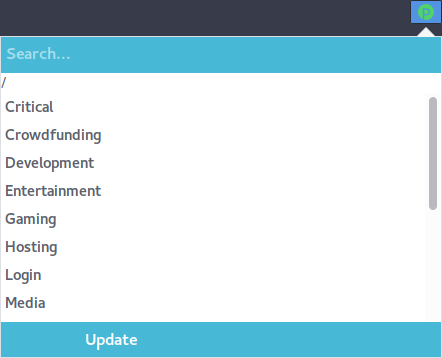
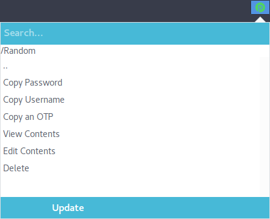
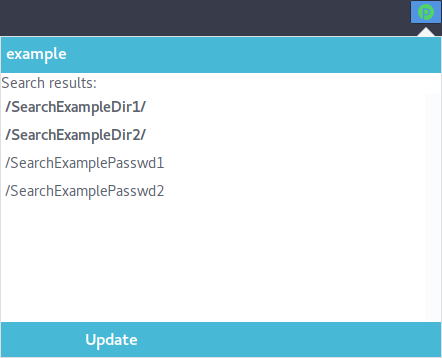
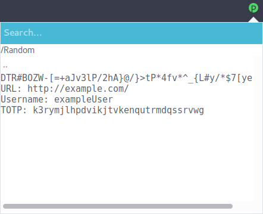
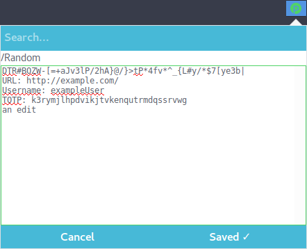

# LEGACY EXTENSION
This extension was made using the old Firefox Addon SDK, which means it won't work after Firefox 57 (Quantum).
Once I make a new a new version of this addon using the WebExtensions framework, it'll be available at [tulir/passfox](https://github.com/tulir/passfox)

# passFox
A passwordstore.org extension for Firefox.

You can find signed packages in the [Release section](https://github.com/tulir/passfox/releases)

## Features
passFox is at an early stage, but the basic features are in.

### Currently implemented features
* Listing passwords and directories
* Basic search (case-insensitive, by file and directory name)
* Copying passwords, usernames and one-time passwords*
* Displaying the content of password files
* Creating, editing and deleting passwords

\* OTP currently only with [my pass fork (tulir/pass)](https://github.com/tulir/pass).
I haven't been able to find a nice (small) JavaScript OTP library.

### Planned features
* Creating directories
* Generating passwords
* Detecting correct password based on URL
	* Config for manually assigning a specific password file for an URL
* Preferences
* (Much) Better error handling
* Autofill ([Soon™](http://wowwiki.wikia.com/wiki/Soon))

## Preview
Here are some fancy screenshots.

#### List view

#### Password action view

#### Search view

#### View view

#### Edit view

